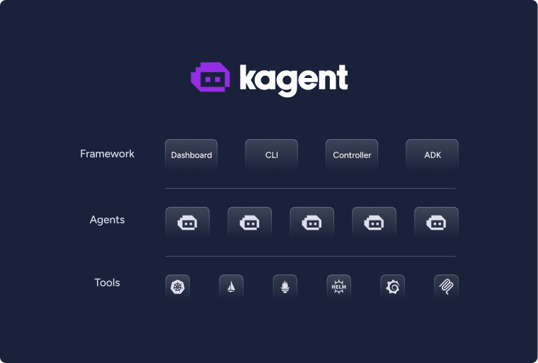

## Hi there 👋

  <picture>
    <source media="(prefers-color-scheme: dark)" srcset="https://raw.githubusercontent.com/kagent-dev/kagent/main/img/icon-dark.svg" alt="kagent" width="400">
    <source media="(prefers-color-scheme: light)" srcset="https://raw.githubusercontent.com/kagent-dev/kagent/main/img/icon-light.svg" alt="kagent" width="400">
    
  </picture>
  

    
    
    
  

---

**kagent** is a Kubernetes native framework for building AI agents. Kubernetes is the most popular orchestration platform for running workloads, and **kagent** makes it easy to build, deploy and manage AI agents in Kubernetes. The **kagent** framework is designed to be easy to understand and use, and to provide a flexible and powerful way to build and manage AI agents.

  

---

## Get started

- [Quick Start](https://kagent.dev/docs/kagent/getting-started/quickstart)
- [Installation guide](https://kagent.dev/docs/kagent/introduction/installation)

The kagent documentation is available at [kagent.dev/docs](https://kagent.dev/kagent/docs).

## Contributors

Thanks to all contributors who are helping to make kagent better.

## Star History

<a href="https://www.star-history.com/#kagent-dev/kagent&Date">
 <picture>
   <source media="(prefers-color-scheme: dark)" srcset="https://api.star-history.com/svg?repos=kagent-dev/kagent&type=Date&theme=dark" />
   <source media="(prefers-color-scheme: light)" srcset="https://api.star-history.com/svg?repos=kagent-dev/kagent&type=Date" />
   
 </picture>
</a>
